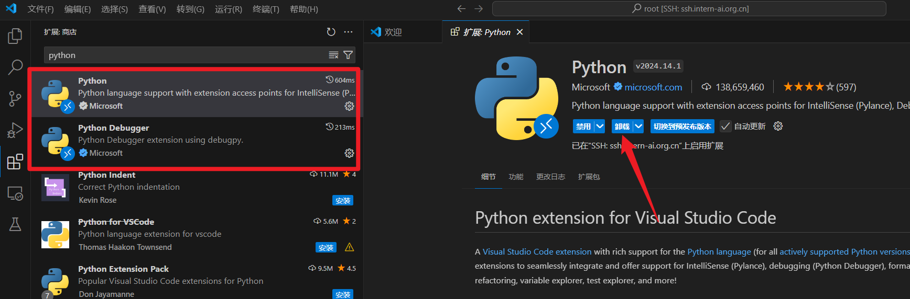
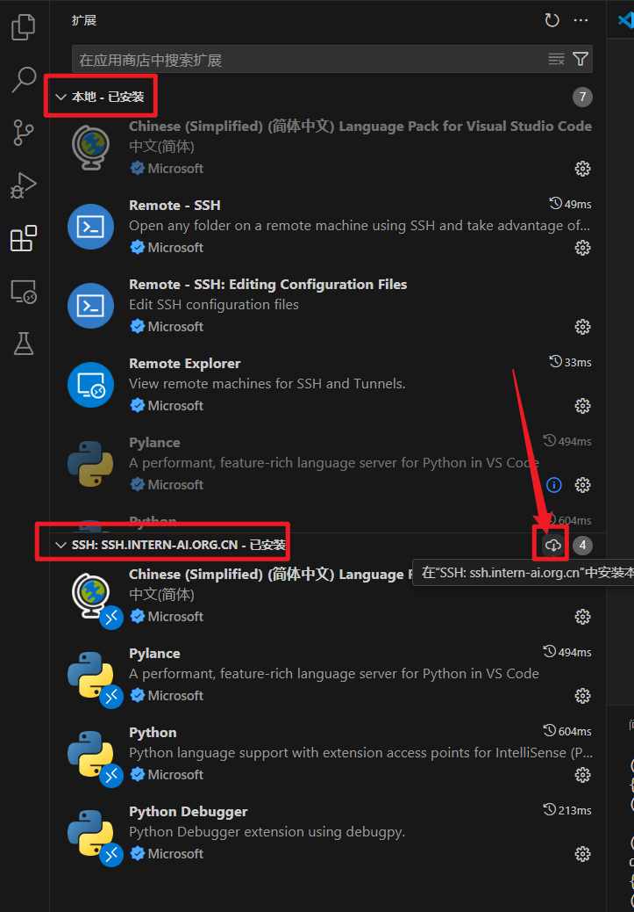
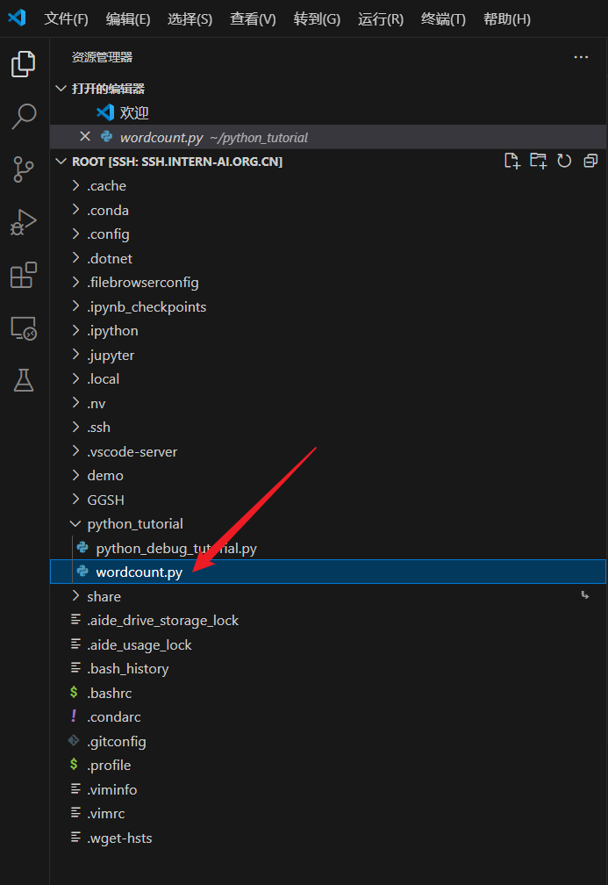
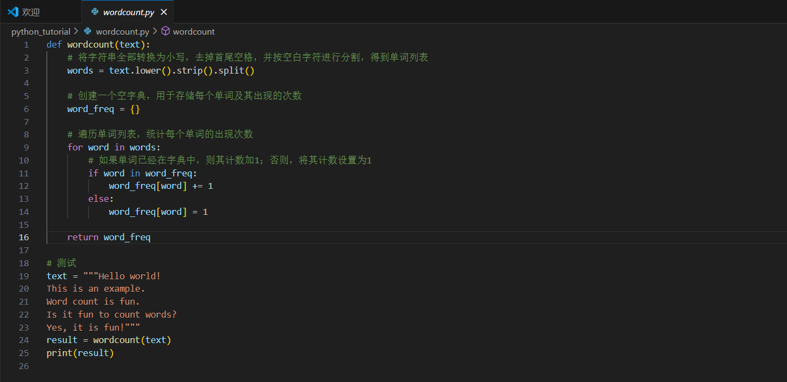
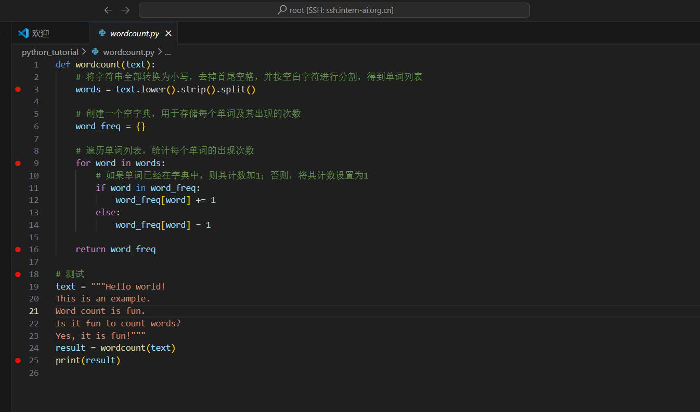
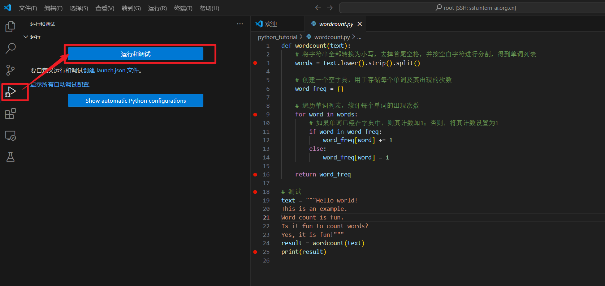
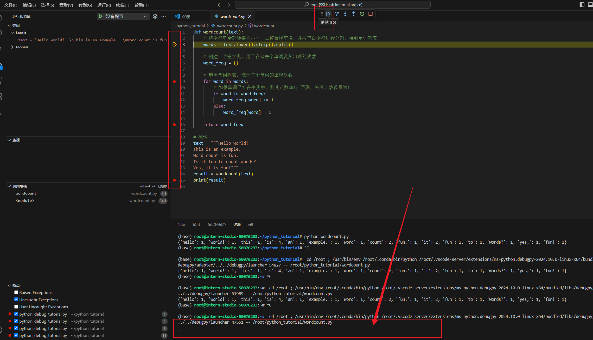
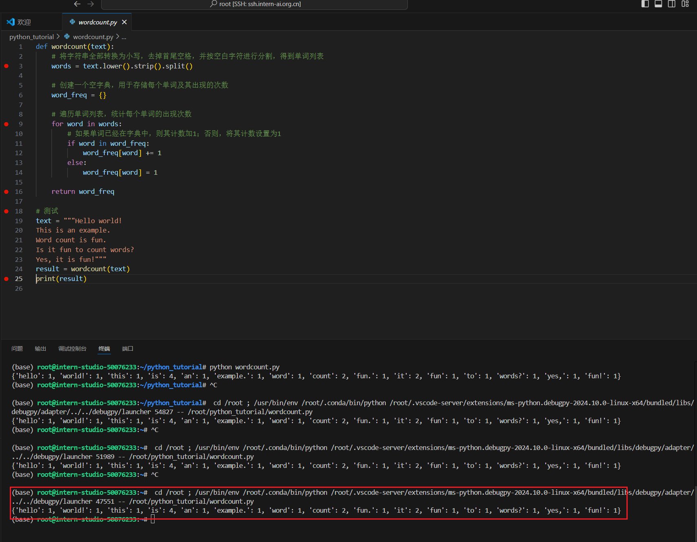

# 入门岛
# 第二关 Python 基础知识
## 1. 远程开发机上已经配置了python环境，可以直接用，不用再重装了
## 2. 通过vscode在远程开发机上安装插件
需要安装两个插件：
打开vscode直接在插件面板里找到python 和 python Debugger，点右侧的安装按纽即可

分清插件安装在本地还是远程开发机器上

上面是本地.已安装 ，下面是开发机的名字代表远程.已安装，如果远程没安装本地已安装过了就点“在XXX机上安装本地扩展”，VSCODE会自动把本地的扩展安装到开发机上

任务一，
1. 按要求建个文件

2. 编写代码

完成！

任务二，

1. 打开文件，设置断点

2. 打开运行和调试

3. 逐步运行，观察断点位置和终端输出

直到终端正常输出为止：

